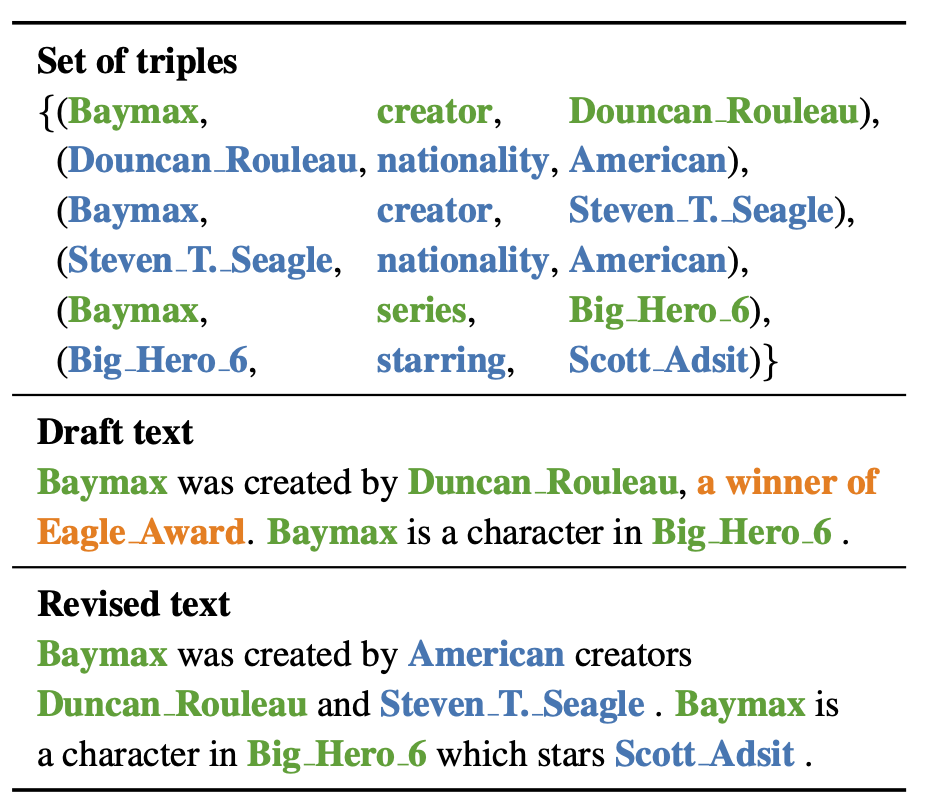
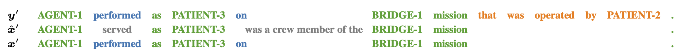
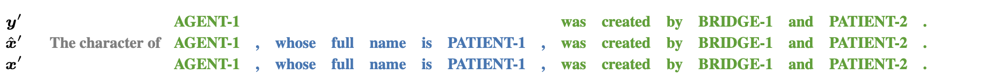
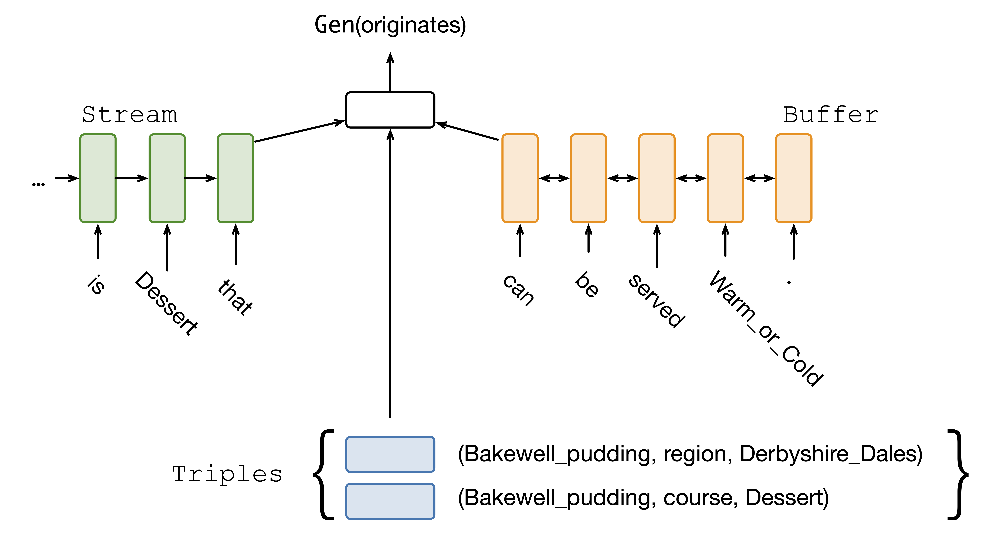

# Fact-based Text Editing
[](https://www.aclweb.org/anthology/2020.acl-main.17/)
[](https://arxiv.org/abs/2007.00916/)
[](https://isomap.github.io/slides/iso2020acl.pdf)

<p align="center"></p>


Datasets for [Fact-based Text Editing (Iso et al; ACL 2020)](https://www.aclweb.org/anthology/2020.acl-main.17/).
Code will be uploaded soon.

# Dataset
<p align="center"></p>

Datasets are created from publicly availlable table-to-text datasets.
The dataset created from ["webnlg"](https://github.com/ThiagoCF05/webnlg/) referred to as "webedit", and the dataset created from ["rotowire(-modified)"](https://github.com/aistairc/rotowire-modified) referred to as the "rotoedit" data.


To extract the data, run `tar -jxvf webedit.tar.bz2` to form a webedit/ directory (and similarly for rotoedit.tar.bz2).

# Model overview
<p align="center"></p>

The model, which we call **FactEditor**, consists of three components, a buffer for storing the draft text and its representations, a stream for storing the revised text and its representations, and a triples for storing the triples and their representations.

FactEditor scans the text in the buffer, copies the parts of text from the buffer into the stream if they are described in the triples in the memory, deletes the parts of the text if they are not mentioned in the triples, and inserts new parts of next into the stream which is only presented in the triples.

# References
```tex
@InProceedings{iso2020fact,
    author = {Iso, Hayate and
              Qiao, Chao and
              Li, Hang},
    title = {Fact-based Text Editing},
    booktitle = {Proceedings of the 58th Annual Meeting of the Association for Computational Linguistics (ACL)},
    pages={171--182},
    year = {2020}
  }
```
